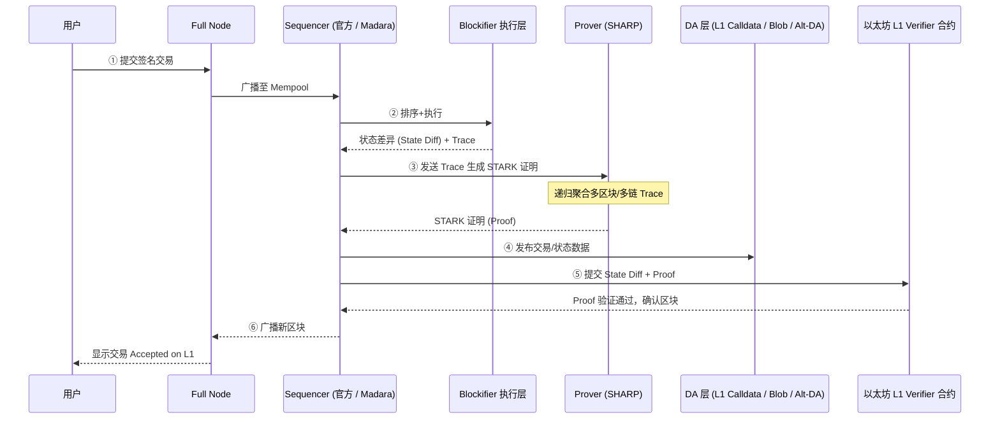

## 概述

Starknet 是由 StarkWare 打造的 **以太坊二层（L2）网络**，采用 STARK 有效性证明（Validity Proof）技术对大量交易进行汇总，继而以简洁、量子安全的证明将数据与状态更新提交到以太坊主网。其目标是在 **无需牺牲去中心化与安全性** 的前提下，实现高吞吐量、低交易费用与更佳的开发者体验。

---

## 基础

### 以太坊的可扩展性挑战
以太坊主网的共识层对区块大小、Gas 总量有严格限制，单区块处理能力约为 **15–20 TPS**。当链上活动剧增时，Gas 价格攀升，用户体验受损。

### ZK Rollup 简介 —— Starknet 存在的意义
**ZK Rollup** 将交易执行与数据可用性分离：
1. 在链下批量执行交易并生成状态差异；
2. 创建零知识有效性证明，保证链下执行正确；
3. 将打包后的交易数据 + 证明提交到 L1，实现 **安全继承** 与 **成本分摊**。

Starknet 作为通用 ZK Rollup：
* **任意计算**：支持通用智能合约，而非仅限交易撮合或交易所场景。
* **Account Abstraction**：账户即合约，天然支持多签、社交恢复等高级账户逻辑。
* **低成本 + 高吞吐**：通过批量证明与递归技术，单笔费用随用户数量增加而显著降低。

### Starknet 在 ZK 技术上的贡献
1. **STARK 证明系统**：基于哈希函数的透明证明，无需可信设置，抗量子攻击。
2. **Cairo 语言**：为编写可被 STARK 证明的程序而生，用一种高级语言描述算术化执行跟踪。
3. **SHARP Prover**：共享证明服务，将多个应用的执行痕迹归并生成单一证据（递归证明）。
4. **Sierra & Cairo 1.0**：提供更安全的中间表示与现代语法，降低合约审核成本。

### EVM 等效性与 Starknet
尽管 Starknet 原生语言为 **Cairo**，生态亦逐步拥抱 EVM 兼容：
* **Warp**：Solidity→Cairo 的源码级转译器，方便现有合约迁移。
* **Kakarot**：在 Starknet 内部实现的 EVM 解释器，目标是 L2 内完全复现 EVM 语义。
* **Madara**：基于 Substrate 的 Starknet 兼容链框架，为开发者提供 EVM/其它 VM 的可插拔选项。

---

## 网络参与者

| 角色 | 描述 |
|------|------|
| **用户 (End-User)** | 通过钱包（Argent X、Braavos 等）签名并提交交易。账户即合约，可自定义签名逻辑、限额等。 |
| **Sequencer** | 负责接收交易、排序、执行，并提交 L2 区块提议。当前由 StarkWare 运营，去中心化版本规划中。 |
| **Prover / SHARP** | 汇集多个区块的执行跟踪，生成 STARK 证明并提交至以太坊。递归技术使证明规模对交易数亚线性增长。 |
| **Blockifier** | 开源执行引擎 (https://github.com/starkware-libs/blockifier) ，用于将 Sierra/Cairo 字节码转换为状态差异。Sequencer 本地执行及离线仿真皆依赖该组件。 |

---

## 存取款详细介绍

### 存款（Deposit）
1. **L1→L2 消息**：用户在以太坊桥合约（StarkGate）调用 `deposit`，锁定 ERC-20 资产并发送跨链消息。
2. **Sequencer 包含消息**：Sequencer 监听 L1 事件并在指定时段强制包含（*force include*）所有待处理消息，确保 **抗审查**。若 Sequencer 刻意忽视，任何人可在以太坊上触发强制包含逻辑。
3. **L2 铸造代币**：消息在 L2 被消费后，于用户的 L2 地址铸造对应数量的跨链映射代币。

### 提款（Withdraw）
提现流程详见 `withdraw.md`，核心步骤简述如下：
1. 用户在 L2 调用 `initiate_token_withdraw`；桥合约燃烧代币并发送 L2→L1 消息。
2. 证明上链并被 L1 桥消费后，用户在桥合约执行 `withdraw` 领取 L1 资产；或勾选 **一键提现** 由服务商自动执行。

---

## StarkWare / Starknet 在零知识领域的贡献

* **STARK 证明体系** — <https://starkware.co/stark>
* **Cairo 语言与工具链** — <https://github.com/starkware-libs/cairo>
* **递归 STARK（SHARP）架构** — StarkWare 白皮书 <https://starkware.co/sharp>
* **dYdX / ImmutableX / Sorare 等应用的扩容实践** — 案例集合 <https://starkware.co/case-studies/>

> 上述技术为 Starknet 提供了可扩展、安全、无需可信设置的核心竞争力。

---

## 组件协作与数据流

下图展示了一笔交易从用户发起到最终在以太坊确认的 **完整流水线**，以及各组件的交互方式：

关键步骤解析：
1. **交易收集**：Full Node 负责对交易做基础合法性检查后转发给 Sequencer。
2. **排序与执行**：Sequencer 调用 Blockifier 执行 Cairo/Sierra 合约，输出状态差异及可验证 Trace。
3. **生成证明**：Trace 被送往 SHARP（或其它 Prover）生成 STARK 证明；多区块可递归合并以摊薄费用。
4. **数据可用性 (DA)**：Sequencer 需将交易数据或状态差异发布到以太坊 Calldata / Blob (EIP-4844) / 其它 DA 层，确保网络可重演。
5. **结算**：Sequencer 或 Orchestrator 将 State Diff + Proof 提交到 L1 核心合约；合约验证通过后，新的状态根正式生效。
6. **同步**：Full Node 获取新区块与状态更新，服务查询与后续交易。

> 提示：在 **Madara** 架构中，第 3-5 步由 *Orchestrator* 服务统一调度；官方 Starknet Sequencer 则由内部流程直接完成。

### 协议核心组件一览

| 层级 | 组件 | 典型实现 | 主要职责 | 关键依赖 & 上游 / 下游 |
|------|------|----------|----------|------------------------|
| 用户侧 | 钱包 / SDK | Argent X、Braavos、starknet.js | 生成签名交易、调用合约、监控状态 | 调用 Full Node RPC |
| 节点层 | Full Node | Pathfinder、Juno、Papyrus | 保存状态、验证区块、提供 RPC、转发交易 | 与 Sequencer 同步区块；服务用户 |
| 排序层 | Sequencer | starkware-libs/sequencer (官方)、Madara (Substrate) | 收集 & 排序交易；调用执行层；产出区块 | 调用 Blockifier；向 Prover / DA / L1 提交数据 |
| 执行层 | Blockifier (Cairo VM) | blockifier | 执行 Cairo/Sierra，生成 State Diff + Trace | 被 Sequencer 或 Orchestrator 调用 |
| 证明层 | Prover | SHARP、Atlantic 等 | 将 Trace 转换为 STARK 证明；支持递归聚合 | 接收 Sequencer Trace；输出 Proof 供 L1 验证 |
| 数据可用性层 | DA | 以太坊 Calldata、Blob；Celestia … | 持久化交易 & 状态数据，保证可重演 | Sequencer 发布数据；L1 合约记录承诺 |
| 结算层 | L1 Verifier 合约 | Starknet Core on Ethereum | 验证 STARK 证明，更新全局状态根 | 依赖 Proof & State Diff；服务桥接与消息 |
| 跨链通信 | L1↔L2 Bridge | StarkGate、Messaging 合约 | 资产存取款、消息传递 | 依赖 L1 合约状态；由 Sequencer 消费 / 发送消息 |
| 调度层 | Orchestrator (可选) | Madara-orchestrator | 管理 SNOS 执行、证明提交、DA 发布、状态更新 | 协调 Sequencer / Prover / DA / L1 多任务 |

> 备注：官方 Sequencer 将调度、提交等逻辑内聚在单体服务；Madara 采用独立 **Orchestrator** 微服务解耦，便于横向扩容与自定义。

#### 组件关系总结

* **纵向依赖**：钱包 → Full Node → Sequencer → Blockifier → Prover → L1 合约；任一环节失败，链上状态不会更新。
* **横向协作**：
  * Sequencer 与 DA 层并行交互，确保数据可用与状态提交同步完成。
  * Orchestrator 充当 Sequencer 外围"流水线调度器"，统一管理证明、DA、结算等异步任务。
* **可替换点**：
  * Sequencer 实现可选官方 Python 或 Rust/Substrate（Madara）。
  * Prover 可切换至社区实现（如 zkStack、Circle-STARK）。
  * DA 层可升级至 EIP-4844 Blob、Celestia、EigenDA 等低成本方案。

如此一来，Starknet 形成了"钱包⟶节点⟶排序⟶执行⟶证明⟶结算"的模块化流水线；每一层既可独立演进，也通过标准接口与上下游组件保持解耦与兼容。 