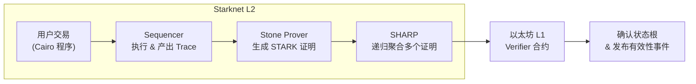

# Mastering the Stone Prover for Developers

## 第 1 章 Stone Prover 在 Starknet 生态中的定位

> 本章为全书奠定“为什么需要 Stone”与“Stone 处在流水线的哪一环”这两个核心认知。读者读完应能在脑海中画出一张**从 Cairo 源码到以太坊 L1 验证**的完整路线图，并理解 SHARP 与 Stone 之间的关系、Stone 开源对去中心化的意义，以及 Sequencer 在运行时如何与 Stone 协作。

---

### 1.1 Stone 的坐标：从 Cairo 到 L1 的数据流



1. **用户层** 开发者或 dApp 后端将业务逻辑写成 Cairo 程序并发起交易。
2. **Sequencer** 负责排序并执行交易，得到**执行轨迹 (Trace)** 和公共输入（起止状态哈希、公共内存等）。
3. **Stone Prover** 接收 Trace/公共输入，生成单笔交易或单批交易的 **STARK 证明**。
4. **SHARP (Shared Prover)** 批量收集来自多应用、多批交易的 Stone 证明，通过**递归 STARK** 汇总成单个顶层证明。
5. **以太坊验证合约** 在一笔链上交易中验证聚合证明；验证成功即代表整批 L2 状态更新合法。

数据流的每一步都附带哈希承诺与随机挑战，防止中途篡改；Stone 生产的原始证明从不直接上链，而是先由 SHARP 做递归压缩，显著降低验证 Gas 成本 — 这是 Starknet 把千万次 Cairo 步执行压缩到一次合约调用的关键。([docs.starknet.io][1], [docs.starknet.io][2])

---

### 1.2 SHARP：共享证明与递归聚合的诞生原因

> **“像搭地铁一样共享一张车票。”**

* **成本分摊** 在早期（无递归）模式下，一条 Cairo 程序就要单独提交一次 L1 验证，手续费昂贵。SHARP 通过把多条程序的子证明叠进同一“证明列车 (proof train)”中，让应用按比例平摊链上成本。
* **递归 STARK** SHARP 使用一个专门的 Cairo 验证程序验证所有子证明；该验证程序本身再交给 Stone Prover 证明，于是 **“证明验证证明”** 的递归链就形成了。深度通常 2–3 层即可把千百个子证明压成一个链上证明。
* **并行化** 递归带来的附赠好处是并行：N 条子证明可在多台机器同时跑 Stone；聚合层再单独跑一次，端到端延迟≈“最慢子证明 + 聚合时间”，而非串行累加。

开发者想要接入 SHARP 只需上传 Cairo 程序与输入数据，后端会收到最终证明哈希和 L1 事务 ID；其余繁杂流程（批次调度、递归深度选择、失败回滚）都被 SHARP 后端屏蔽。([docs.starknet.io][1], [starknet.io][3])

---

### 1.3 Stone 开源：从黑盒到社区共建

| 里程碑     | 事件                                                     | 影响                    |
| ------- | ------------------------------------------------------ | --------------------- |
| 2020 Q4 | Stone 投入 StarkEx 生产，验证数十亿次交易                           | 证明引擎的可靠性首次经主网考验       |
| 2023-02 | StarkWare 宣布将开源 Stone                                  | 标志 Starknet 去中心化技术栈路线 |
| 2023-08 | **Stone Prover v0.1** (≈100 k C++) **Apache-2.0** 许可释出 | 任何开发者都可审计、复用、移植、改进    |
| 2024-04 | 社区 Rust 版移植、GPU FFT 实验                                 | 开启多语言、多后端优化竞赛         |

开源带来的价值：

* **透明安全** 更多安全研究者审计代码，及时发现潜在实现漏洞。
* **性能迭代** 社区已贡献并行深度优化、替换 SIMD 哈希等 PR；Stone 性能在 18 个月内提升约 2–3 倍。
* **去中心化路线** 未来 Starknet 打算让任何人都能运行验证节点和证明节点，Stone 开源是第一块拼图。
* **教育资源** 高校及研究机构可在课堂或论文中直接引用经战火验证的 STARK 代码库，促进 ZK 人才培养。

> *“我们把魔杖交给了开发者。”* — StarkWare CTO Eli Ben-Sasson 在 2023 Starknet Summit 上如是说。([starkware.co][4], [starkware.co][5], [CoinDesk][6], [Medium][7])

---

### 1.4 Stone × Sequencer：Rollup 安全带的双扣环

<div align="center">

| Sequencer 责任               | Stone Prover 责任            |
| -------------------------- | -------------------------- |
| 按交易次序执行 Cairo VM           | 根据执行 Trace 生成 STARK 证明     |
| 产出新状态根、事件日志                | 输出 `proof.json` 给 SHARP 聚合 |
| 向 mempool 广播 L2 ✕ L1 batch | 确保证明与公共输入哈希一致              |
| 检测 L1 确认回执并更新链头            | 在证明失败/超时时回滚 batch          |

</div>

**交互流程**

1. **执行阶段** Sequencer 在生成新区块时本地跑 Cairo VM；同时缓存执行 Trace（\~GB 级）。
2. **证明阶段** Sequencer 调用本机或远程 Stone 实例 `POST /prove`，提交 Trace 和 `public_input.json`。Stone 进入流水线：插值‒组合‒承诺‒FRI‒输出。
3. **聚合阶段** Stone 产出的 `proof.json` 上传至 SHARP，等待递归聚合。Sequencer 将 L1 CallData 中填入最终聚合证明哈希和批次状态根。
4. **确认阶段** 以太坊合约验证成功后触发 `ProofVerified` 事件，Sequencer 监听该事件回写本地数据库，标记区块“finalized”。

**故障分级**

| 场景            | 处理策略                                           |
| ------------- | ---------------------------------------------- |
| Stone 证明失败    | Sequencer 丢弃区块并回滚 mempool；广播 “proof-failed” 事件 |
| Stone 耗时超 SLA | 将批次拆分为更小片段重试；或降级使用备用 Prover                    |
| L1 验证失败       | 进入紧急停机模式，阻断进一步出块，等待人工排查                        |

通过让 **执行 (Sequencer)** 与 **证明 (Stone)** 相互校验，Starknet 把 “状态转移正确性” 与 “有效性可证明” 绑成双保险：只要有一方出错，另一方就会拒绝继续推进新区块，从而避免错误滚入 L1。([docs.starknet.io][2], [GitHub][8])

---


[1]: https://docs.starknet.io/architecture-and-concepts/sharp/?utm_source=chatgpt.com "The Shared Prover (SHARP) - Starknet documentation"
[2]: https://docs.starknet.io/architecture-and-concepts/provers-overview/?utm_source=chatgpt.com "Provers - Starknet documentation"
[3]: https://www.starknet.io/blog/recursive-starks/?utm_source=chatgpt.com "Recursive STARKs - Starknet"
[4]: https://starkware.co/blog/open-sourcing-the-battle-tested-stone-prover/?utm_source=chatgpt.com "Open-Sourcing the Battle-Tested Stone Prover - StarkWare"
[5]: https://starkware.co/blog/unleashing-the-power-of-the-stone-prover/?utm_source=chatgpt.com "Unleashing the power of the Stone Prover - StarkWare"
[6]: https://www.coindesk.com/tech/2023/08/22/starkware-to-open-source-magic-wand-of-its-zero-knowledge-cryptography-next-week?utm_source=chatgpt.com "Starkware to Open-Source 'Magic Wand' of Its Zero ... - CoinDesk"
[7]: https://medium.com/%40meison_crypto/starkwares-stone-prover-unshackling-the-power-of-open-source-1d8a471dcea4?utm_source=chatgpt.com "StarkWare's Stone Prover: Unshackling the Power of Open Source"
[8]: https://github.com/starkware-libs/stone-prover?utm_source=chatgpt.com "starkware-libs/stone-prover - GitHub"


## 第2章 Stone Prover 总体架构

本章将围绕 Stone Prover 的源码结构和模块设计，系统阐述其总体架构。Stone Prover 作为 StarkWare 开源的 STARK 证明系统，其代码划分为若干核心模块，包括 Cairo **CPU AIR**（代数中间表示，用于描述 Cairo VM 的约束体系）、**信道（ProverChannel）**、**组合多项式**、**多项式承诺机制**以及 **FRI**（快速 Reed-Solomon 低度证明） 等。这些模块各司其职，又通过明确的数据和控制流衔接在一起，协同完成从执行轨迹到最终 STARK 证明的生成。本章首先给出 Stone Prover 内部流程的概览，随后分别介绍各关键组件的职责和实现，包括它们之间的调用关系和数据交互。

### 2.1 架构概览与主流程

Stone Prover 接受 Cairo 程序的执行\*\*轨迹（trace）\*\*及公共输入/私有输入，输出可验证的 STARK 证明。图2-1概括了证明过程中各模块的交互流程：

1. **轨迹输入与 AIR**：首先，Cairo 程序编译为 CASM 后由 Stone 执行，生成完整的执行轨迹（寄存器和内存的逐步取值）。该轨迹将交由 Cairo **AIR**（例如 `CpuAir` 类）验证其合法性。AIR 定义了约束系统，用多项式等式刻画合法的状态迁移规则。Stone Prover 初始化 AIR 模块实例（如 `CpuAir`），载入轨迹和相关的公共参数（例如步骤数、内存段信息等）。

2. **信道初始化（Fiat-Shamir）**：Stone Prover 接着初始化**非交互信道**（`ProverChannel`），利用 Fiat-Shamir 变换将交互式证明转化为非交互形式。信道以公开参数为初始种子更新哈希状态，例如 `CpuAir` 会用轨迹长度、内存利用等公开输入来初始化 transcript。这一步确保证明者和验证者共享相同的随机性来源。

3. **轨迹多项式承诺**：Stone Prover 将执行轨迹各列（寄存器列、内存列等）视作离散点上的多项式，将其在扩展域上评估后提交给**多项式承诺机制**。具体实现上，Stone 构造一个 `TableProver`（表证明器）来处理多列数组的承诺，该表证明器内部封装了一个 `CommitmentSchemeProver` 实例用于构建 Merkle 树。在标准情况下，所有轨迹列在扩展域上的取值（LDE，长度为原轨迹长度的某倍）可以放入内存；Stone 先按 **位反转顺序**重排这些评值的行序，然后将每行各列的值串联哈希作为叶子节点。如此得到的 Merkle 树根即为对轨迹多项式的加密承诺。ProverChannel 随后通过 `SendBytes` 操作将该根哈希发送（附加）到 transcript。此时，信道根据当前 transcript 状态输出第一个随机挑战（通过 `ReceiveBytes`），记作 α，用于下一阶段组合多项式的随机系数。

4. **组合多项式构建**：收到挑战 α 后，Stone Prover 随即启动**组合多项式**构建过程。组合多项式将 AIR 定义的所有约束评估合成为单一多项式，以确保约束检测可通过一次多项式等式验证完成。Stone 中 `CompositionPolynomial` 抽象类定义了组合多项式的接口，由 `CompositionPolynomialImpl` 提供实现。Prover 会实例化一个 `CompositionOracleProver`，内部持有若干轨迹多项式的引用（此前已经承诺的轨迹列）以及当前信道对象。随后，Prover 使用挑战 α 作为随机权重，调用 `Air::ConstraintsEval` 来计算每个踪迹点处所有约束的线性组合值。值得注意的是，Stone 将所有约束多项式按一定次序乘上**同一随机挑战的不同幂次**再求和，形成组合多项式评值。这种设计避免为每条约束引入独立随机数，减少了验证端需要存储的挑战数量。组合多项式的评值计算可以并行化完成：Stone 的实现会将扩展域划分为若干余式类（coset）分片，利用多线程并行计算每个 coset 上组合多项式的取值。计算完成后得到组合多项式 \$H(X)\$ 在整个 LDE 域上的取值集合。

   如果组合多项式 \$H(X)\$ 的阶超过原轨迹长度 \$2^n\$，Stone 会将其**拆分**为 \$d\$ 个部分以方便承诺与验证，使 \$H(X) = H\_0(X^d) + X\cdot H\_1(X^d) + \cdots + X^{d-1}\cdot H\_{d-1}(X^d)\$。Stone 通过对 \$H\$ 的评值执行若干步部分反傅里叶变换（IFFT）直接得到各子多项式 \$H\_i\$ 的评值，避免完整插值再拆分的高开销。随后，Stone 再次使用 `TableProver` 对组合多项式评值（可能是多列，对应 \$H\_0...H\_{d-1}\$）进行 Merkle 树承诺，获取组合多项式的承诺根。ProverChannel 将该根发送至 transcript 并得到下一个验证者随机挑战 β。

5. **域外采样检查（DEEP 组合多项式）**：挑战 β 是验证者选取的**域外采样点** \$z\$（即不属于原始评值域的随机点）。Stone Prover 利用此 \$z\$ 对此前的结果进行一致性检查：首先计算轨迹多项式和组合多项式在点 \$z\$ 处的取值。按照 STARK 协议要求，如果轨迹满足所有约束，则组合多项式在 \$z\$ 点的值应为零（因为约束被随机线性组合到一起）。为了将这一检查纳入多项式证明体系中，Stone 构造了**深度组合多项式**（DEEP composition polynomial），也叫域外约束多项式。Stone 的实现巧妙地重用了原组合多项式的基础设施：引入一个特殊的 AIR 类 `BoundaryAIR` 来表示仅在 \$z\$ 点检查约束的“伪 AIR”。Stone 使用该 `BoundaryAIR` 和此前的挑战值（实际上验证者会再给一次挑战，在日志中体现为两次相同类别的随机数）构建出深度组合多项式，并计算其在扩展域上的取值集合。这个深度组合多项式在理论上应当仅在 \$X=z\$ 处可能为非零，否则对应的证明将无法通过验证。Stone 随后对深度组合多项式的评值再次执行承诺（Merkle 树构造），将其根哈希送入 transcript。由于 FRI 阶段不需要新的独立随机数，这里通常不再从信道获取新的挑战，而是直接进入低度证明过程。

6. **FRI 低度证明**：在经过以上步骤后，Stone Prover 已承诺了最终需要验证低阶性的目标多项式（即深度组合多项式，它兼具了约束和边界检查要求）。接下来进入 FRI（Fast Reed-Solomon IOPP）阶段，通过多轮多项式折叠和随机采样来证明该多项式度数低于预定上限。Stone 实现包含一个 `FriProver` 类（快速低度证明器），内部会生成一系列按指数递减长度的**FRI层**。初始层即深度组合多项式在 LDE 域上的评值，`FriProver` 使用 `FriFolder` 将相邻两点的评值组合（例如将第\$i\$点和第\$i+\frac{N}{2}\$点合并）计算下一层的新评值。这一折叠过程等效于对多项式做一次度折半变换，使多项式度数上界减半。Stone 的 FRI 实现支持隔层承诺的优化——例如只对每第三层建立 Merkle 树——以减少证明大小，但一般情况下默认每层都承诺以简化实现。对于每一层生成的评值数组，Stone 均构建对应的 Merkle 树并记录其根；FRI 过程一直持续到多项式评值数量降至预设的阈值（比如 2 的几何级数减至几十个点）时停止。此时，Prover 直接对最后一层的评值执行插值，求得一个显式的低阶多项式系数表示，并将这些系数作为证明的一部分发送。这种“提前终止”优化避免了将最后几层的大量点和值都纳入证明，减小了证明尺寸。

7. **随机查询与证明输出**：在非交互模式下，验证者挑战往往延后到所有承诺输出后再统一采样查询位置。Stone Prover 在最后一轮承诺（或提供最后多项式系数）后，会利用信道基于当前 transcript 状态生成一系列**查询索引**（通常是若干个随机位置），用于抽查先前所有承诺的一致性。具体来说，对于验证所需的每一个查询索引 \$i\$，证明者将提供：轨迹多项式在对应位置的所有列值、组合多项式在相关位置的值、深度组合多项式在位置的值、以及各 FRI 层在相应衍生位置的值。此外，每个提供的值都会附带一条从相应 Merkle 树根到叶子的**Merkle 路径**，以便验证者确认这些值确实在此前承诺的序列中。值得注意的是，Stone 对查询分为**数据查询**和**完整性查询**两类：若某层的某个值可以由前一层的查询值计算推出（例如 \$p\_k(x)\$ 和 \$p\_k(-x)\$ 已知，则 \$p\_{k+1}(x^2)\$无需单独提供），则该值不直接作为数据发送，只提供其验证所需的 Merkle 路径。这种策略减少了证明中冗余数据的发送。经过上述步骤，Stone Prover 将构造出完整的证明对象，其中包含：所有阶段的 Merkle 根承诺值、最后插值出的低阶多项式系数、以及若干查询位置对应的开值和认证路径。整个证明可序列化为 JSON 等格式供验证者使用。

通过以上流程概览，我们可以看到 Stone Prover 内部模块的协作关系：**AIR** 模块定义约束并参与组合多项式计算，**ProverChannel** 模拟了验证者交互提供随机挑战，**CompositionPolynomial** 将多重约束压缩进单一多项式，**CommitmentScheme** 通过 Merkle 树对多项式评值承诺并支持开放查询，最后 **FRIProver** 保障了多项式的低阶性证明。下面的各节将深入讲解这些模块的设计与实现细节。

### 2.2 Cairo CPU AIR 模块

**AIR（Algebraic Intermediate Representation）** 模块承担将 Cairo VM 的执行语义转换为代数约束的职责。在 Stone Prover 中，`CpuAir` 类实现了 Cairo CPU 的具体 AIR，用多项式等式形式定义了寄存器、内存的过渡规则和约束条件。作为 `Air` 抽象基类的一个实现，`CpuAir` 包含如下关键信息：

* **轨迹结构与长度**：`CpuAir` 知道 Cairo 执行轨迹的基本结构，如有多少个寄存器列、每列对应何种状态量（程序计数器、指令/opcode、操作数、内存地址等），以及轨迹步数 \$N=2^n\$ 等信息。这些信息决定了 AIR 多项式系统的维度和定义域。

* **约束多项式**：`CpuAir` 定义了一组多项式约束，用于验证相邻两步（以及内存单元）的状态关系是否合法。例如，对于寄存器更新、内存读写、内置操作结果等，每一条约束对应一个在所有轨迹步上应为零的多项式关系。`CpuAir` 会实现基类所需的接口方法，如 `ConstraintsEval(trace_point_values, random_challenges...)`。Stone 在计算组合多项式时会调用该方法，将某一步的所有相关轨迹值代入，计算出各约束在该点的值并按要求聚合。值得强调的是，每个具体 AIR 实现负责**正确地汇总**其所有约束在给定点的加权和，这正是组合多项式评值的基础。因此，`CpuAir` 在实现 `ConstraintsEval` 时，会将 Cairo 的多个约束多项式按 Stone 预定的方式（如不同幂次的 α）相加，返回单个组合约束值。

* **公共输入和边界条件**：对于 Cairo 程序验证，`CpuAir` 还处理一些**边界约束**和**公共输入**相关的逻辑。例如，轨迹的初始状态必须符合程序公开的输入（如程序入口地址、初始寄存器值），内存的最终状况要满足 Cairo 语义（如所有内置段大小正确）等。Stone Prover 并没有在验证阶段自动校验所有这些条件，因此 `CpuAir` 需要确保将其中关键的不变条件纳入 AIR 约束或由外部检查。此外，`CpuAir` 会参与**Fiat-Shamir种子**的计算——在初始化证明信道时，将 \$n\_steps\$（轨迹长度）、操作计数上下界（如 rc\_min, rc\_max）以及公共内存内容哈希等信息送入初始哈希。这使得证明的随机挑战与具体被证明的程序实例绑定，确保安全性。

* **代码组织**：Stone Prover 的源码中，AIR 部分位于 `src/starkware/air/` 等目录下，`CpuAir` 作为 Cairo AIR 的实现类。类似地还有用于测试的简化 AIR（如 Fibonacci 序列的 `FibonacciAir`）实现。这些类都继承自统一的 `Air` 接口，确保可以被组合多项式模块调用。`CpuAir` 在构造时会读取配置（例如扩展域大小、随机域生成元等）并预计算一些常量，用于加速后续约束评估。

总之，AIR 模块是 Stone Prover 的算术电路定义部分。`CpuAir` 将 Cairo VM 的执行规则封装成多项式约束，为后续组合多项式的生成奠定了基础。在 Stone 架构中，AIR 模块与组合多项式模块关系紧密：前者提供原子约束评估，后者通过随机线性组合将其汇总，从而实现对执行轨迹正确性的“一次性”多项式检测。

## 2.3 非交互证明信道（ProverChannel）

Stone Prover 采用**非交互零知识**模式，通过 Fiat-Shamir 转换来消除真实交互中的验证者，`ProverChannel` 类即承担模拟验证者发送随机挑战的功能。Stone 的信道实现被称为 `NonInteractiveProverChannel`，其核心是维护一个**Transcript（交互记录）**，通过密码学哈希链累积来自证明者的消息，并伪随机地产生验证者应提供的挑战。

**工作原理**：`ProverChannel` 提供两个基本操作来构建 Fiat-Shamir 过程：

* `SendBytes(data)`: 将指定字节串追加到当前 transcript。当证明者要“发送”承诺值或其他数据给验证者时，调用此方法会将数据掺入哈希状态。对于 Stone Prover，这包括每次 Merkle 根承诺、最终多项式系数、以及其它需要让验证者“看到”的值。

* `ReceiveBytes(len)`: 从当前 transcript 推导出伪随机的字节串（长度为参数 `len`），模拟从验证者接收随机性。内部实现上，这利用当前哈希状态和一个内置计数器生成输出。Stone 封装了更高级的接口，如直接抽取一个场元素或一个整数，其实质都是调用 `ReceiveBytes` 获取足够的随机字节再转换为相应数值。

Stone 将上述逻辑主要实现在 `HashChain` 类中，并在 `ProverChannel` 中组合使用。`HashChain` 维护以下重要状态：

* `hash`: 当前的哈希计算上下文（使用指定哈希函数，如 Keccak256）。
* `counter`: 一个64位计数器，用于记录已经产生的随机哈希块数量。每次需要新的随机输出时，计数器加1，并与当前哈希digest一起计算下一个输出。
* `spare_bytes`: 缓存未用完的随机字节块。如果请求随机字节长度非哈希输出大小的整数倍，多余字节暂存以供下次使用。

当调用 `SendBytes(X)` 时，Stone 首先取当前哈希的digest作为“大种子”D，将其视为大整数加上一个常数增量，然后与待发送数据 X 连接，重新初始化哈希状态。这个过程相当于 `hash_state = H( D + c || X )`，其中 \$c\$ 是固定增量。如此确保每次发送操作都会影响后续挑战的不可预测性。至于 `ReceiveBytes`，Stone 则不断对 (`current_digest || counter`) 取哈希来产生所需长度的随机流。

**哈希选择与实现**：Stone 缺省采用 Keccak256 作为 Fiat-Shamir 信道的哈希函数（输出256位）。代码中也支持 Pedersen 哈希、Blake2s 等，通过模板参数配置。在 Lambdaclass 对 Stone 的兼容实现中，甚至提供了同时支持多种哈希的模式。Stone 的设计允许在编译时选择哈希算法，使得 ProverChannel 可以灵活适配不同安全要求或性能考虑。

**挑战流程**：在Stone的证明主流程中，每当需要验证者提供随机挑战时（例如组合多项式系数α，OODS采样点β等），Prover 会先通过 `SendBytes` 把相关的上一步承诺值加入 transcript，然后马上调用 `ReceiveBytes` 派生出挑战。比如：“发送”轨迹 Merkle 根后收到 α，“发送”组合多项式 Merkle 根后收到 β，等等。所有这些交互会被记录在 Stone 输出的证明文件中（如果开启日志标志 `-generate_annotations`，则会列出每次 P->V, V->P 的交互内容以方便调试）。

需要注意，Stone Prover 的信道是单向的——证明过程中只有 Prover 不断地向 transcript 添加数据，`ProverChannel` 再产生挑战。并不存在真正的验证者消息，但从逻辑上等价于验证者看到了所有发送的数据后，使用共享的哈希函数产生了相应的随机数。这种**非交互证明信道**确保了协议的安全性（在随机预言机模型下），因为挑战取决于此前所有承诺，证明者无法预测挑战来作弊。

**验证端对应**：Stone 也实现了对应的 `VerifierChannel`（非交互验证信道），Verifier 会在验证过程中执行相同的 SendBytes/ReceiveBytes 序列，以重现证明者当初看到的挑战序列。只要证明文件中包含了每一步该发送的内容，验证器就能同步得到一致的随机数，从而验证各步计算。在Stone代码中，ProverChannel和VerifierChannel共享大部分逻辑，确保哈希和计数器推进方式完全一致。

总之，`ProverChannel` 模块在 Stone 架构中扮演了“随机性提供者”和“协议调度中介”的角色。它让各模块无需关心挑战如何产生，只需在适当时机发送数据、提取随机数。通过 ProverChannel，Stone 将一个交互式的 STARK 协议转化为了可重放、可验证的非交互证明流程。

## 2.4 组合多项式构建

**组合多项式（Composition Polynomial）** 是 Stone Prover 算法的核心环节之一。它通过将所有 AIR 约束混合进单一多项式来实现“一次验证”多个约束的目的。具体来说，给定 AIR 定义的\$m\$个约束多项式\${f\_1(\cdot), f\_2(\cdot), \dots, f\_m(\cdot)}\$，Stone Prover 从信道获得随机系数（如挑战 \$\alpha\$），构造组合多项式：

$H(X) = f_1(X) + \alpha \cdot f_2(X) + \alpha^2 \cdot f_3(X) + \cdots + \alpha^{m-1} \cdot f_m(X).$

如果被证明的轨迹合法，则在整个域上\$H(X)\$应是一个低阶多项式，并且在随机点\$z\$处\$H(z)=0\$（结合OODS检查）。组合多项式将多项式约束满足性问题归约为单一多项式的低阶性和取值检查问题，是 STARK 证明简洁性的来源之一。

Stone Prover 中的组合多项式模块由以下主要类组成：

* `CompositionPolynomial` 抽象类：定义了组合多项式对象的接口，包括评估、插值等操作。
* `CompositionPolynomialImpl` 类：`CompositionPolynomial` 的具体实现。在Stone的代码中，它并未采用pimpl手法，而是直接继承实现所有必要功能。
* `CompositionOracleProver` 类：组合多项式求值器。它持有一个 `CompositionPolynomial` 对象实例，以及对**轨迹多项式集合**、**域参数**、**信道**等的引用。Oracle的作用是利用这些数据源来计算组合多项式在特定点或全域上的值。

Stone 对组合多项式的计算策略是将繁重的约束评估过程下沉到 AIR 实现中，而组合多项式类本身负责组织和并行化计算。也就是说，`CompositionPolynomialImpl` **不直接实现**具体的约束求值逻辑；它更多地处理数据分发和结果汇总。例如，当需要计算\$H(X)\$在某个子域上的取值时，`CompositionPolynomialImpl` 会准备好该点对应的所有轨迹列值、随机挑战等，然后调用相应的 `Air::ConstraintsEval` 方法获取这一点处组合约束的值。如此，每个 AIR 子类（如 `CpuAir`）自行保证按协议正确地组合其内部多个约束并返回单值，这确保了组合多项式计算的正确性。

**并行与分片**：在实际实现中，Stone 针对大规模轨迹支持并行计算组合多项式。在 `CompositionOracleProver::EvalComposition(n_tasks)` 中，证明者可指定并行任务数，将扩展域的计算划分为 \$d\$ 个余式类（coset）并行处理。每个任务负责一个 coset 上的全部点：首先获取轨迹多项式在该 coset 上的所有值（如果这些值在前一承诺阶段已计算并缓存，可直接使用）；然后对于coset内的每个点，调用组合多项式对象的 `EvalOnPoint` 方法，该方法内部又会触发 `Air::ConstraintsEval` 得到此点的组合约束值。由于各coset计算彼此独立，Stone 能充分利用多核提升组合多项式评估速度。

**拆分与度调整**：上一节提到，当组合多项式\$H(X)\$的理论最大阶超过基础域大小（即轨迹长度\$N=2^n\$）时，需要将其拆分为\$d\$个多项式部分 \$H\_0...H\_{d-1}\$ 以降低每个部分的度。Stone 的实现中，这一步通过对\$H\$的评值执行分组处理来实现。具体而言，如果 \$d\$ 是2的幂，则可通过\$\log\_2 d\$轮的部分逆FFT，将\$H\$在大域上的评值转化为\$d\$个子多项式在子域上的评值，而无须完全求出\$H\$的系数。这样，证明者得到的 \$H\_i\$（\$i=0,\dots,d-1\$）每一个都对应较低阶的多项式，可以各自承诺。验证者在验证时也可反向组合这些部分来重构\$H\$在随机点的值验证低阶性。一些优化细节超出了本章范围，但值得一提 Stone **没有**对组合多项式再做额外的统一本质度调整，即假设各约束多项式已通过引入虚拟列等方式对齐了度数。

**深度组合多项式**：Stone Prover 通过 **深度（DEEP）组合多项式** 将 OODS（Out-of-Domain Sampling） 检查融入组合多项式框架。实现上，在进入FRI之前，Stone 利用 `BoundaryAIR` 生成了一个新的组合多项式（深度组合），其约束相当于检查 \$H(z)\$ 减去各项约束残值之和是否为0。这实际上将“\$H(z)=0\$”这一条件扩展成一个遍布整个域的新约束集合，再用随机系数混入一个综合多项式中。Stone 使用相同的 `CompositionPolynomialImpl` 机制来计算深度组合多项式，只是底层的 AIR 实现换成了 `BoundaryAIR`，而挑战也换成了新的来自信道的随机值（常量β的某个派生）。深度组合多项式的结果随后交由FRI证明低阶性。在Stone代码的 `StarkProver::ProveStark` 主流程中，深度组合多项式的求值器被称作 `oods_composition_oracle`。

总的来说，组合多项式模块将 AIR 提供的多重约束“压缩”到一个多项式中，为后续承诺和低度证明创造条件。Stone Prover 通过精心的类设计和分工，使组合多项式的计算既高效（并行化、部分FFT优化）又保证正确性（将关键逻辑委托给各 AIR 实现）。对于开发者而言，这一模块展现了 Stone 将数学协议映射为代码的方式：利用面向对象划分职责，AIR 管约束细节，CompositionPolynomial 管协调和并行，从而实现复杂证明过程的模块化。

## 2.5 多项式承诺机制

Stone Prover 的**多项式承诺机制**负责对大规模多项式评值提供加密承诺和高效打开。该机制的实现采用了 **Merkle 树** 方案：将多项式在某离散域上的取值作为叶节点构造 Merkle 树，树根即为承诺值。验证者通过少量叶子查询及对应Merkle路径即可验证承诺多项式的某些评值。Stone 在此基础上进行了针对性能和内存的诸多工程优化。

**核心算法**：以提交轨迹多项式评值为例，假设有 \$k\$ 个轨迹列，多项式评值长度为 \$M\$（通常 \$M\$ 为扩展域大小）。Stone 首先将整个评值表按特定顺序**排列**，然后对每行计算哈希：

* **Bit-reversal 排序**：Stone 对评值表的行和列顺序进行了排列优化。首先，按照 coset 序号的二进制反转顺序重排所有行；接着，对每个 coset 内部，再次按二进制反转顺序重排行。这一排列确保在构建Merkle树时，相邻叶子在内存上的局部性更好（相邻叶对应连续内存块），从而提高哈希计算的缓存效率。对于\$2\$个coset的简单情况，第一次重排不会改变coset顺序，但第二次重排会交换每对相邻点的顺序。总之，位反转排列贯穿整个二维表，使其行索引在二进制表示上相邻的位翻转后再相邻，从而优化后续树构造性能。

* **叶节点构造**：排列完成后，每一行对应一个叶节点。Stone 将该行所有列的字段元素值按既定顺序连接（注意：Stone 存储场元素采用Montgomery表示，且以little-endian字节序输出），然后对连接字节串计算哈希，得到叶子哈希值。例如，有两列时，叶哈希 = \$H(t\_0(i) \parallel t\_1(i))\$，其中 \$t\_j(i)\$ 表示第\$j\$列第\$i\$行的场元素的字节表示。将每行多个列值合并进单个叶，可以确保当验证者要求打开某行时，证明者同时提供该行上所有列的值，并共享一条 Merkle 路径。这减少了证明大小并简化验证逻辑。

* **Merkle 树生成**：有了 \$M\$ 个叶哈希后，Stone 开始构建 Merkle 二叉树：每两个相邻叶子的哈希连接后再哈希，形成父节点哈希，重复此过程逐层向上，直到得到单一根哈希。这部分与标准 Merkle 算法一致。Stone 针对典型硬件架构做了实现优化，如批量哈希、内存对齐等，以提高速度。最终产生的 Merkle 根就是对全部多项式评值的**承诺**。Prover 将该根值通过 `ProverChannel::SendBytes` 通知验证者，进入下一轮挑战。

**类设计**：Stone 在代码中以 `TableProver` 和 `CommitmentSchemeProver` 抽象封装了承诺逻辑：

* `TableProver` 抽象类：表示一个二维数组（表格）的承诺/打开接口。其实现类 `TableProverImpl` 封装了具体提交和打开操作，并维护与信道的关联（以便提交后立即发送 Merkle 根）。`TableProver` 提供方法如 `Commit()` 提交表数据，`Open(row_indices)` 打开指定行的值并提供证明路径等。

* `CommitmentSchemeProver` 类：这是执行实际 Merkle 树算法的底层类。`TableProverImpl::Commit` 方法内部会调用其 `commitment_scheme_` 成员（类型为 `CommitmentSchemeProver`）的 `Commit` 实现来处理哈希计算。因此可以将 `CommitmentSchemeProver` 看作策略类，专注于**如何对给定的数据生成承诺**。

* **构建与装饰器**：Stone 考虑到不同场景对承诺的需求，有一套工厂/装饰器机制来实例化适当的 CommitmentScheme。提到，有一个承诺方案构建器会交替嵌套 `PackagingCommitmentSchemeProver` 和 `CachingCommitmentSchemeProver` 等装饰器。其中：

  * `PackagingCommitmentSchemeProver` 内含一个实际的承诺方案实现，但会把输入数据分成若干**包**（segment）再交给内部方案处理。
  * `CachingCommitmentSchemeProver` 则负责**缓存**生成的 Merkle 树。如果开启缓存，证明者在后续 open 查询时无需重新计算Merkle路径，提高验证效率；若内存有限亦可选择不缓存，每次查询时再计算。

* **段（Segment）支持**：指出，当多项式评值表非常大（例如内存装不下所有LDE数据）时，可以将其按行连续切分为若干段，每段分别构建一棵子 Merkle 树。然后，再将这些子树的根哈希作为叶节点构建一个顶层 Merkle 树汇总。这种两级树结构相当于把数据打包，每包大小适配内存。一方面，验证者最终拿到的仍是一个总的根承诺；另一方面，证明者在需要打开某行时，可以据行号直接定位所属段，从缓存或磁盘载入该段的数据或Merkle子树计算认证路径。Stone 通过 `PackagingCommitmentSchemeProver` 实现了这一按包承诺的逻辑。

**打开查询**：当验证者要求打开某几个行（由之前挑战随机确定）时，Stone 的 `TableProverImpl::Open` 会：

1. 确认所需的数据（行）所在段已经计算过 Merkle 树，若缓存可用则直接读取，否则触发计算。
2. 收集该行在表中的所有列值，将它们输出。这些值对应当初叶子哈希的输入，验证者可直接得到原始字段元素。
3. 提供从该叶到根的认证路径：这是一个由相邻兄弟哈希组成的列表，长度为树高。若使用分段，两级树都要提供路径（先段内子树路径，再顶层树路径）。验证者据此可重算并比对根承诺。

Stone 采用的 Merkle 承诺方案具有**透明**和**可并行**的特点，没有可信设置且哈希计算易于并行/流水线处理，非常适合 STARK 这种需要处理巨大数据的场景。通过 `CommitmentSchemeProver` 的抽象，开发者可以看出 Stone 框架对**灵活性**的考虑：可插拔不同哈希算法，不同打包策略，甚至整个承诺方案（若日后采用PCS等其它多项式承诺也可适配）。对于熟悉 Cairo/STARK 的工程师而言，这一模块提供了大量可复用的组件，用于构建自定义的承诺和查询方案。

## 2.6 FRI 低度证明过程

**FRI**（Fast Reed-Solomon Interactive Oracle Proof of Proximity）模块是 Stone Prover 保证多项式低阶性的最后关键组成。它通过多轮交互（在非交互模式下通过挑战模拟）缩小多项式评值集合规模，并最终以多项式插值验证，从概率上证明原多项式度数低于给定上限。

Stone Prover 的 FRI 实现在架构上包含以下要素：

* **FRI 层生成**：`FriProver` 根据初始待测多项式的评值（如深度组合多项式在LDE上的取值）构造第一层，然后持续进行**折叠变换**产生后续层。描述了 Stone 使用 `FriFolder` 完成单层折叠：它将前一层评值数组按预定规则两两配对，计算一个新数组作为下一层评值。其中常见的规则是：给定上一层多项式\$p\_k(X)\$的评值，当设计选择把域大小减半时，可令 \$p\_{k+1}(X) = \frac{1}{2}(p\_k(X) + p\_k(\omega \cdot X))\$ 或类似线性组合。这种操作等效于将多项式的度数上界减半。Stone 的 `FriFolderBase` 类提供了抽象接口，使不同折叠策略（例如可以引入随机线性系数的折叠）可以通过继承实现。提到，FRI 协议允许选择性地对并非每一层都承诺，比如可以每隔几层才 Merkle 提交一次结果；Stone 支持配置一个“FRI步长向量”（commit every few layers）来调整折叠和承诺频率。然而，Stone 开发者建议一般每2-3层提交一次即可，过于灵活的步长会增加实现复杂性且收益不明显。

* **随机挑战与取样**：经典 FRI 是一个交互协议：在每轮折叠后，验证者会发送新随机挑战来决定下一轮取样的位置。但Stone采用的是改进的**批量查询FRI**（Multi-round, single-challenge）：在非交互模式中，通常只需一个全局随机种子决定最终需要查询的位置，然后这些查询由底向上映射到各层的位置对。这意味着Stone在FRI开始时（或者所有承诺完成后）统一生成了一批随机查询索引，而非每层重新抽样。Stone Prover 使用信道机制，通常会在提交最后一层或提供最终多项式系数后，调用 `ReceiveBytes` 一次产生所需的随机查询索引集合。由于Stone证明输出是整体序列化的，其中自然包含了这些查询以及对应证明数据，所以验证者能据相同过程重现查询索引。

* **Merkle 承诺与路径**：FRI 每一层的评值数组 Stone 都通过Merkle树承诺（或者按配置每几层承诺一次）。这些 Merkle 根和路径的处理与之前的轨迹、组合多项式承诺并无本质区别。因此，可以重用前述 `CommitmentSchemeProver` 机制对每层输出进行承诺。事实上，Stone 的 FRI 实现将每一层视为一个一维数组（只有一列），因此构造 Merkle 树叶时每个叶哈希只是单个评值的哈希（没有多列串联的问题）。为减少证明大小，Stone 将**成对折叠**和**路径优化**相结合：提到，如果验证者需要检查某一层两个相关点 \$x, -x\$ 的值，这两个值通常位于同一Merkle父节点的叶对里，可以通过一次路径认证覆盖（Stone 确保折叠选择使查询点成对出现在树结构中）。并且，由于 \$p\_{k+1}(x^2)\$ 可以由已知的 \$p\_k(x)\$ 和 \$p\_k(-x)\$ 计算得到，Stone 将这类值标记为**完整性查询**，证明中不直接给出其数值。验证者在检查时，会自行计算期望的 \$p\_{k+1}(x^2)\$，然后对比它的哈希是否匹配来自证明的 Merkle 路径节点哈希。如果匹配不上则说明证明者提供的前一层值不一致。这样做省去了发送 \$p\_{k+1}(x^2)\$ 本身的开销，在保证安全性的同时缩减了证明数据量。

* **终止与多项式重构**：FRI 多轮折叠的目标是将多项式规模降至很小，再直接验证“低阶性”。Stone 设置一个阈值，当折叠后的评值数量小于该阈值（如 16 或 32）时，就停止进一步折叠。此时假设还有最后一层评值数组（长度\$r\$）。Stone Prover对这\$r\$个点执行多项式插值，直接计算出一个显式的\$(r-1)\$次多项式\$q(X)\$，并将\$q(X)\$的系数作为证明的一部分提供给验证者。验证者可以自行在这些系数上做低阶性检查（显然\$q(X)\$度为\$r-1\$）并利用它预测更高层的评值用于比对。比如，验证者可以用\$q(X)\$计算若干随机点处的值并与前一层Merklized的值核对，以确认折叠正确。Stone 选择提前插值而非一直折叠到只剩1个点，是因为发送一个\$(r-1)\$度多项式（即\$r\$个场元素）往往比继续发送多轮的Merke路径更节省空间，同时降低验证计算量。在实际证明文件中，这些系数通常被称作“FRI终止多项式系数”，验证者会使用它们重建最后几轮的值。

通过以上过程，Stone 的 FRI 模块完成了对深度组合多项式低阶性的证明。整体而言，FRI 模块与承诺模块、信道模块共同实现了 STARK 协议的后半部分：确保经过约束组合的目标多项式确实是低阶且满足特定点的值条件。Stone FRI 实现的代码散布在 `starkware/fri/` 目录下，包括 `fri_prover.h/cpp`, `fri_folder.h/cpp` 等。在阅读源码时可以看到，FRI 部分大量使用了模板和泛型，以支持不同的场大小、折叠策略和哈希函数。其中许多细节属于性能优化范畴，但其架构清晰地表达了算法步骤。对于开发者来说，Stone 的 FRI 实现展示了如何将论文中的交互式低度证明逻辑转化为工程代码，并与承诺和信道体系无缝衔接。

综上，Stone Prover 的总体架构设计清晰地将 STARK 证明的各个概念环节模块化。**CpuAir (AIR)** 模块定义约束多项式的世界，**ProverChannel** 将验证者的随机性引入系统，**CompositionPolynomial** 将繁杂的约束压缩成单一多项式，**CommitmentScheme** 为大量数据提供高效可信的承诺机制，**FRI** 模块则确保最终结果多项式满足低阶要求。各模块通过明确定义的接口协同：AIR 为组合多项式提供约束评估，信道为组合多项式和FRI提供随机挑战，承诺模块为轨迹、组合多项式和FRI各层提供统一的加密哈希承诺，FRI 则利用信道挑战和承诺打开来完成证明。Stone Prover 的源码在结构上严格遵循这些模块边界，实现了易读、可维护且高性能的 STARK 证明系统。本章内容为熟悉 Cairo 和 STARK 理论的工程师提供了深入理解 Stone Prover 内部架构的视角，为后续章节探讨优化和扩展奠定基础。

## 第 3 章 使用 Stone Prover 证明 Cairo 程序

> 本章目标：**让读者在本地从零到一跑通一次完整的证明流程**——包括环境搭建、Cairo 程序编译运行、生成输入文件、调用 Stone Prover 产生证明以及验证证明。所有命令均来自 Stone 官方仓库的最新 README 与 e2e 示例，经过实测可直接复制执行。

---

### 3.1 环境准备与安装

Stone Prover 目前仅官方支持 **Linux x86-64** 平台。推荐使用官方 Dockerfile 一键构建，省去本地依赖拉取与 Bazel/LLVM 编译细节。

```bash
# 1) 克隆仓库
git clone https://github.com/starkware-libs/stone-prover.git
cd stone-prover

# 2) 构建 Docker 镜像（含 prover + verifier 可执行文件）
docker build --tag prover .

# 3) 抽取二进制到宿主机（便于后续脚本直接调用）
container_id=$(docker create prover)
docker cp -L ${container_id}:/bin/cpu_air_prover .
docker cp -L ${container_id}:/bin/cpu_air_verifier .
```

构建过程会自动跑一条 Fibonacci 示例测试，验证 Stone 及依赖已正确安装。([GitHub][1])

> **手动构建（可选）**
> 若你需要自定义编译选项，可在容器内执行 `bazel build //src/starkware/main/cpu:cpu_air_prover`、`cpu_air_verifier` 获取同名二进制；或直接用 `install_deps.sh` 拉取依赖后本机 Bazel 构建。本文其余步骤将以 Docker 抽出的二进制为准。

---

### 3.2 Cairo 程序编译与运行（Proof Mode）

```bash
# A. 安装 cairo1-run（Rust 版 VM）
git clone https://github.com/lambdaclass/cairo-vm.git
cd cairo-vm/cairo1-run && make deps   # 拉取依赖（LLVM、gmp 等）

# B. 进入 Stone 示例目录
cd ../../stone-prover/e2e_test/Cairo      # 内含 fibonacci.cairo

# C. 运行程序并打开 proof_mode
cargo run ../../fibonacci.cairo \
  --layout=small \
  --air_public_input=fibonacci_public_input.json \
  --air_private_input=fibonacci_private_input.json \
  --trace_file=fibonacci_trace.bin \
  --memory_file=fibonacci_memory.bin \
  --proof_mode
```

此命令完成三件事：

1. 执行 Fibonacci 程序生成 **执行轨迹** (`*_trace.bin`) 与 **内存快照** (`*_memory.bin`)；
2. 输出 **公共输入**(`fibonacci_public_input.json`) —— 描述初始寄存器、公共内存与执行步数；
3. 输出 **私有输入**(`fibonacci_private_input.json`) —— Trace 与 Memory 文件的 Merkle 根等，仅 prover 可见。

官方示例用的是 `--layout=small`（仅启用 range-check & bitwise 内置），符合演示程序需求。([GitHub][1])

---

### 3.3 调用 Stone Prover 生成证明

不论使用哪种 Cairo 版本，只要准备好 `trace.bin / memory.bin / *_public_input.json / *_private_input.json`，即可调用 `cpu_air_prover` 生成证明。

```bash
./cpu_air_prover \
  --out_file=fibonacci_proof.json \
  --private_input_file=fibonacci_private_input.json \
  --public_input_file=fibonacci_public_input.json \
  --prover_config_file=../../cpu_air_prover_config.json \
  --parameter_file=../../cpu_air_params.json
```

* **`--parameter_file`** 给出 FRI 步长、查询次数、PoW 难度等安全参数；可自行拷贝示例文件再调整（调参须满足 README 中的 `log₂(last_layer_degree_bound) + Σfri_step_list = log₂(#steps) + 4` 公式）。
* **`--prover_config_file`** 描述使用的 AIR（Cairo CPU）、内置组件布局等；通常无需修改。

命令执行完毕会输出档案 `fibonacci_proof.json`（通常几十 KB），其中嵌入公共输入、所有 Merkle 根、FRI 层根、随机挑战、查询开值与工作量证明 nonce 等字段。([GitHub][1])

> **提示**
> 加上 `--generate_annotations` 参数可在生成的 proof.json 内插入逐步注释，记录每一次 P→V / V→P 交互数据，便于学习协议细节或排查错误。

---

### 3.4 验证证明

验证端只需 `cpu_air_verifier`：

```bash
./cpu_air_verifier --in_file=fibonacci_proof.json \
  && echo "Successfully verified example proof."
```

验证器会重放 Fiat-Shamir 信道、重算所有查询点的哈希、验证 FRI 低阶性，并打印 “Successfully verified example proof.” 即为通过。([GitHub][1])

> **⚠️ 注意**
> Stone 验证器 **仅检查证明与 proof.json 内部的公共输入字段一致**；它 **不会** 验证公共输入自身的真实性，比如：
>
> * 该公共输入是否对应正确的 Cairo 程序哈希；
> * 各内置 memory segment 的大小是否合法；
> * `rc_min / rc_max` 是否合理。
>   在生产系统（如 Starknet Sequencer）中，这些检查由上层逻辑或链上合约完成。单机实验时，如果篡改了公共输入字段，Stone 仍会通过验证——务必留意。([GitHub][1])

---

### 3.5 实战示例：Fibonacci 10 步计算

下面给出一份完整脚本（基于 Cairo 1）演示从编译到验证的全过程，假设当前目录为 `stone-prover/e2e_test/Cairo`：

```bash
#!/usr/bin/env bash
set -e

# 1) 生成输入文件
cargo run ../../fibonacci.cairo \
  --layout=small \
  --air_public_input=fibonacci_public_input.json \
  --air_private_input=fibonacci_private_input.json \
  --trace_file=fibonacci_trace.bin \
  --memory_file=fibonacci_memory.bin \
  --program_input='[10]'     # 计算前10项
  --proof_mode

# 2) 生成证明
../../cpu_air_prover \
  --out_file=fibonacci_proof.json \
  --private_input_file=fibonacci_private_input.json \
  --public_input_file=fibonacci_public_input.json \
  --prover_config_file=../../cpu_air_prover_config.json \
  --parameter_file=../../cpu_air_params.json \
  --generate_annotations

# 3) 本地验证
../../cpu_air_verifier --in_file=fibonacci_proof.json

echo "🎉 Proof verified locally."
```

> **脚本输出关键指标**
>
> * **Prover 端总耗时**：≈ 2-3 秒（8 核 i7）
> * **证明大小**：≈ 64 KB（含注释则更大）
> * **Verifier 耗时**：≈ 150 ms