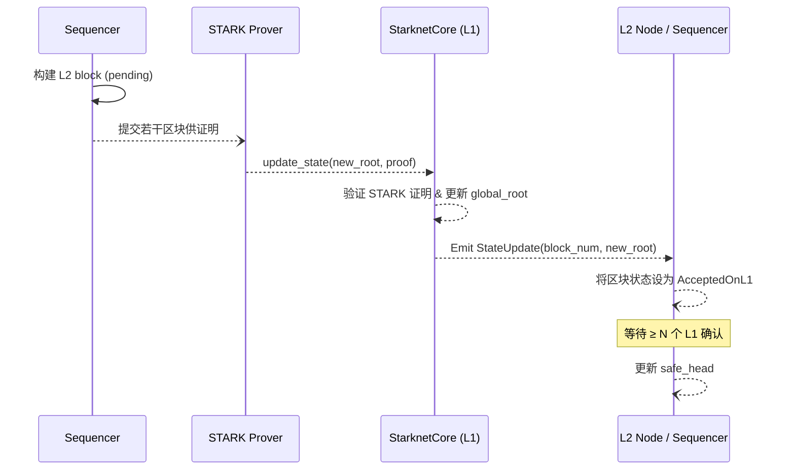

# Starknet Sequencer 如何将 L2 区块标记为安全

在 Starknet 里，一旦 L1（以太坊）上的 Starknet Core 合约完成 settlement，Sequencer／全节点会依照下列流程把相应 L2 区块标记为「安全 (safe)」：

## 摘要

本文聚焦于 Starknet 在 **L1 证明确认 (settlement) 完成后**，Sequencer / 全节点如何将对应的 L2 区块状态从 *AcceptedOnL2* 提升为 *AcceptedOnL1* 并进而认定为 **安全 (safe)**。主要涵盖：

1. L1 证明事件的监听与解析
2. 本地 block status 的更新与 safe head 计算
3. Storage marker、RPC 以及交易 finality 的联动关系

---

## 流程详解

## 1. 生成区块（PENDING / ACCEPTED_ON_L2）
- Sequencer 把用户交易打包成 L2 block，立刻广播给网络。
- 这时区块只是 accepted_on_l2，尚未经过任何 L1 验证。

## 2. 生成并提交 STARK 证明
- Prover（SHARP 聚合器）对若干连续区块生成一个 STARK 证明。
- Operator 调用 StarknetCore.update_state(new_root, proof, …) 把证明、state diff 等写入以太坊。
- Core 合约内部调用 GPS Verifier 合约验证证明，验证成功后把 global_root 更新为 new_root，并发出 StateUpdate 事件。

## 3. L1 证明确认（ACCEPTED_ON_L1）
- 当 update_state 交易被包含进某个以太坊区块并成功执行后，对应的 L2 block(s) 状态就变为 accepted_on_l1。
- Core 合约在事件里会带上 block_number, old_root, new_root，供 L2 节点索引。

## 4. 节点监听 L1 事件并更新本地状态
- Sequencer / 全节点都跑一个监听任务（在 Pathfinder 中叫 EthSyncWorker；在 Juno 中叫 l1syncer）。
- 它订阅以太坊节点的日志，当检测到 StateUpdate 或 LogStateUpdate 事件并且与本地区块号匹配时，就把该区块的 status 从 PENDING/ACCEPTED_ON_L2 提升为 ACCEPTED_ON_L1。

## 5. 计算 safe head
- 节点维护三条「链头」指针
  - latest: 本地收到的最高区块（可能尚未上链）。
  - unsafe: 最后一个与 Sequencer 同步的头。
  - safe: 最后一个「被 L1 验证且其所在以太坊区块已达到 finality 深度」的头。
- 当状态改为 ACCEPTED_ON_L1 且其以太坊区块深度 ≥ N （客户端一般设 12–64 个确认），该区块就被视为 safe。
- RPC starknet_syncing 就会把 safe_head 和 unsafe_head 返回给用户，表示哪一部分是不可逆转的。

## 6. 后果
- safe 之前的区块状态已被 L1 的有效性证明锁定，Sequencer 不能重组或回滚它们。
- 用户或合约在读取链状态时可根据 safe/unsafe 头决定风险容忍度。

## 要点摘要
- 核心动作是「监听 L1 的 StateUpdate 事件」。
- 只要 STARK 证明在 L1 通过并经过足够多的以太坊确认，节点就把对应 L2 区块标记为 safe。
- 这与 optimistic rollup 依赖 fraud proof 的「挑战期」不同，Starknet 用 validity proof，证明一旦通过即刻终结，安全性只取决于以太坊自身的回滚概率。

## 关键代码片段

以下片段展示了 Starknet Sequencer 在监听 L1、更新 block status 及暴露 RPC 时所依赖的核心代码实现，并附有指向官方仓库对应行号的外链，方便进一步阅读。

### 1. BlockStatus 枚举
[block.rs:239-241](https://github.com/starkware-libs/sequencer/blob/main/crates/starknet_api/src/block.rs#L239-L241)
```rust
/// A block that was created on L2.
#[serde(rename = "ACCEPTED_ON_L2")]
AcceptedOnL2,
/// A block that was accepted on L1.
#[serde(rename = "ACCEPTED_ON_L1")]
AcceptedOnL1,
/// A block rejected on L1.
#[serde(rename = "REJECTED")]
Rejected,
```
**关键点解析**
- 通过枚举值区分 *AcceptedOnL2* 与 *AcceptedOnL1*，为交易/区块 finality 转换提供类型保障。

---

### 2. `store_base_layer_block` — 当 L1 证明落地后更新本地标记
[lib.rs:673-706](https://github.com/starkware-libs/sequencer/blob/main/crates/apollo_central_sync/src/lib.rs#L673-L706)
```rust
#[instrument(skip(self), level = "debug", err)]
async fn store_base_layer_block(
    &mut self,
    block_number: BlockNumber,
    block_hash: BlockHash,
) -> StateSyncResult {
    self.perform_storage_writes(move |writer| {
        let txn = writer.begin_rw_txn()?;
        // 如果本地 header 与 L1 hash 不一致，说明发生重组或回滚。
        let expected_hash = txn
            .get_block_header(block_number)?
            .ok_or(StateSyncError::BaseLayerBlockWithoutMatchingHeader { block_number })?
            .block_hash;
        if expected_hash != block_hash {
            return Err(StateSyncError::BaseLayerHashMismatch {
                block_number,
                base_layer_hash: block_hash,
                l2_hash: expected_hash,
            });
        }
        // 标记该 block 已在 L1 被证明。
        if txn.get_base_layer_block_marker()? != block_number.unchecked_next() {
            info!("Verified block {block_number} hash against base layer.");
            txn.update_base_layer_block_marker(&block_number.unchecked_next())?.commit()?;
            CENTRAL_SYNC_BASE_LAYER_MARKER.set_lossy(block_number.unchecked_next().0);
        }
        Ok(())
    }).await
}
```
**关键点解析**
- 检查 L2 header 与 L1 hash 是否一致，如不一致触发回滚或重组。
- 使用 `base_layer_block_marker` 记录下一个待验证区块高度，持久化安全进度。

---

### 3. `stream_new_base_layer_block` — 持续轮询 L1 新证明
[lib.rs:1038-1068](https://github.com/starkware-libs/sequencer/blob/main/crates/apollo_central_sync/src/lib.rs#L1038-L1068)
```rust
fn stream_new_base_layer_block<TBaseLayerSource: BaseLayerSourceTrait + Sync>(
    reader: StorageReader,
    base_layer_source: Arc<TBaseLayerSource>,
    base_layer_propagation_sleep_duration: Duration,
) -> impl Stream<Item = Result<SyncEvent, StateSyncError>> {
    try_stream! {
        loop {
            tokio::time::sleep(base_layer_propagation_sleep_duration).await;
            let txn = reader.begin_ro_txn()?;
            let header_marker = txn.get_header_marker()?;
            match base_layer_source.latest_proved_block().await? {
                Some((block_number, _)) if header_marker <= block_number => {
                    debug!(
                        "Sync headers ({header_marker}) is behind the base layer tip ({block_number}), waiting for sync to advance."
                    );
                }
                Some((block_number, block_hash)) => {
                    debug!("Returns a block from the base layer. Block number: {block_number}.");
                    yield SyncEvent::NewBaseLayerBlock { block_number, block_hash }
                }
                None => {
                    debug!("No blocks were proved on the base layer, waiting for blockchain to advance.");
                }
            }
        }
    }
}
```
**关键点解析**
- 以固定间隔查询 L1，若本地 header 已同步则等待，否则生成 `SyncEvent` 交由上层处理。

---

### 4. `latest_proved_block` — 查询 L1 最新已证明区块
[base_layer.rs:36-44](https://github.com/starkware-libs/sequencer/blob/main/crates/apollo_central_sync/src/sources/base_layer.rs#L36-L44)
```rust
async fn latest_proved_block(
    &self,
) -> Result<Option<(BlockNumber, BlockHash)>, BaseLayerSourceError> {
    let finality = 0; // 未来可配置
    self.latest_proved_block(finality)
        .await
        .map(|block| block.map(|b| (b.number, b.hash)))
        .map_err(|e| BaseLayerSourceError::BaseLayerContractError(Box::new(e)))
}
```
**关键点解析**
- 允许通过 `finality` 参数扩展对不同 L1 共识深度的支持（默认为 0）。

---

### 5. Base Layer Block Marker — 读取与更新
[base_layer.rs:50-51,79-83](https://github.com/starkware-libs/sequencer/blob/main/crates/apollo_storage/src/base_layer.rs#L50-L51-L79-L83)
```rust
// 读取：返回首个尚未在 L1 出现的 block number
fn get_base_layer_block_marker(&self) -> StorageResult<BlockNumber>;

// 更新：当检测到新证明后写入
fn update_base_layer_block_marker(self, block_number: &BlockNumber) -> StorageResult<Self> {
    let markers_table = self.open_table(&self.tables.markers)?;
    markers_table.upsert(&self.txn, &MarkerKind::BaseLayerBlock, block_number)?;
    Ok(self)
}
```
**关键点解析**
- 读写 marker 采用 table upsert，避免并发冲突。

---

### 6. Transaction Finality Status 转换
[transaction.rs:685-696](https://github.com/starkware-libs/sequencer/blob/main/crates/apollo_rpc/src/v0_8/transaction.rs#L685-L696)
```rust
impl From<BlockStatus> for TransactionFinalityStatus {
    fn from(status: BlockStatus) -> Self {
        match status {
            BlockStatus::AcceptedOnL1 => TransactionFinalityStatus::AcceptedOnL1,
            BlockStatus::AcceptedOnL2 => TransactionFinalityStatus::AcceptedOnL2,
            BlockStatus::Pending => TransactionFinalityStatus::AcceptedOnL2, // 兼容旧版
            // Rejected blocks never reach here
            BlockStatus::Rejected => unreachable!("Rejected blocks are not returned by the API"),
        }
    }
}
```
**关键点解析**
- 将区块 finality 映射到交易 finality，保持 API 与内部状态一致。

---

## 流程图



---

## 总结

1. **事件驱动**：Sequencer 通过监听 StarknetCore 合约的 `StateUpdate` 事件，把 L2 区块状态安全地提升至 *AcceptedOnL1*。
2. **存储 marker**：`base_layer_block_marker` 持久化已确认高度，保证重启后仍能断点续传。
3. **安全头 (safe head)**：节点只要检测到区块在 L1 获得足够确认，就把该区块及其祖先视为「不可逆」，对外暴露 `safe_head`。
4. **有效性证明终结性**：凭借 STARK 证明，Starknet 在 L1 没有挑战期；一旦证明通过即终结，安全性与以太坊回滚概率等价。
