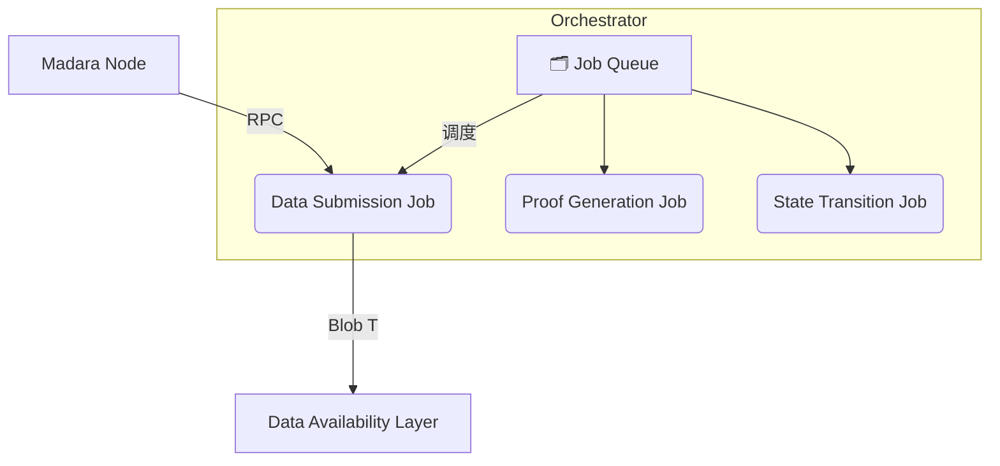

# Madara Orchestrator 中的 **Data Submission Job**

> 对应 OP-Stack 中 **Batcher** 角色的实现

---

## 1️⃣ 背景

在以 **OP-Stack** 为代表的 L2 系统中，_Batcher_ 负责将 L2 交易批量提交到 L1；在 **Madara** 生态里，具有同等职责的组件是 **Orchestrator** 里的 **Data Submission Job（简称 DA Job）**。

- **Orchestrator**：与 Madara 节点并行运行的后台服务，负责区块处理、证明生成、数据提交、状态转换等关键任务。
- **DA Job**：Orchestrator 诸多 Job 之一，专注于「状态更新 → Blob 数据 → 提交 DA 层」的流程。

---

## 2️⃣ Orchestrator 架构速览



---

## 3️⃣ Data Submission Job 职责

| 步骤 | 说明 | 相关代码 |
| ---- | ---- | -------- |
| **1. 获取状态更新** | 通过 RPC 调用 `get_state_update` 拉取区块 `state_update` | [`mod.rs:115-123`](https://github.com/madara-alliance/madara/blob/main/orchestrator/crates/orchestrator/src/jobs/da_job/mod.rs#L115-L123) |
| **2. 转换为 Blob 数据** | `state_update_to_blob_data` 将数据序列化并准备做 FFT | [`mod.rs:135-138`](https://github.com/madara-alliance/madara/blob/main/orchestrator/crates/orchestrator/src/jobs/da_job/mod.rs#L135-L138) |
| **3. 发布到 DA 层** | `da_client().publish_state_diff` 发送 EIP-4844 Blob Tx | [`mod.rs:196-200`](https://github.com/madara-alliance/madara/blob/main/orchestrator/crates/orchestrator/src/jobs/da_job/mod.rs#L196-L200) |
| **4. 验证包含性** | `verify_inclusion` 轮询确认 Blob 被 L1 接纳 | [`mod.rs:221-232`](https://github.com/madara-alliance/madara/blob/main/orchestrator/crates/orchestrator/src/jobs/da_job/mod.rs#L221-L232) |

额外特性：

- **队列化**：所有 Job 通过队列管理生命周期，支持重试、失败回滚。
- **模块化**：未来可接入 Celestia、EigenDA 等多种 DA 方案。

---

## 4️⃣ 与 OP-Stack Batcher 的对比

| 维度 | OP-Stack **Batcher** | Madara **Data Submission Job** |
| ---- | ------------------- | ---------------------------- |
| 运行位置 | 独立进程 | Orchestrator 子任务 |
| 主要输入 | L2 交易列表 | Starknet `state_update` |
| 提交目标 | L1 `batch tx` | DA 层 `blob tx` |
| 验证方式 | 完全由合约验证 | 先链下轮询，再链上验证 |
| 额外功能 | ‑ | 与证明、状态转换 Job 协调 |

---

## 5️⃣ 工作流程（文本版）

摘自 `docs/orchestrator_da_sequencer_diagram.txt`：

```
== Cron: Create jobs for state updates ==
Orchestrator 获取最后一个 update_state Job；若仍在处理中则等待。

== Job: DA Submission ==
Orchestrator → Madara: 获取 state_update
Madara → Orchestrator: 返回 state_update
Orchestrator: 构建 Blob
Orchestrator → Alt DA: 提交 Blob
Alt DA → Orchestrator: ok
== Job Complete ==
```

---

## 6️⃣ 注意事项

1. **并行度**：当前版本为了简化 nonce 管理，按区块顺序串行处理；未来可并行提升吞吐。
2. **失败重试**：若 Blob 提交或验证失败，Job 会自动重试并记录日志。
3. **可插拔 DA**：默认集成 Ethereum EIP-4844，配置切换即可对接其他 DA 层。

---

## 7️⃣ 参考资料

- 源码入口：`orchestrator/crates/orchestrator/src/jobs/da_job/`
- Orchestrator 说明：`orchestrator/README.md`
- 流程图：`docs/orchestrator_da_sequencer_diagram.txt`
- EIP-4844 提案：<https://eips.ethereum.org/EIPS/eip-4844>
