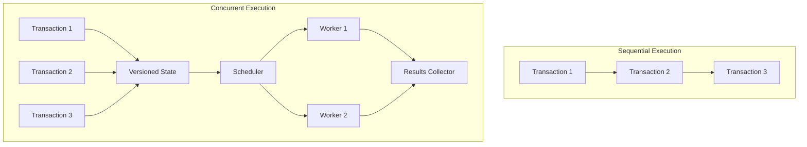
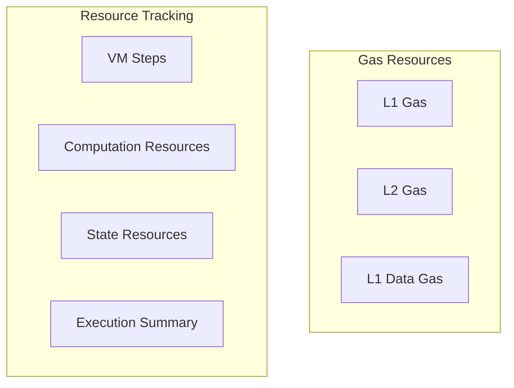

# Starknet Sequencer 复杂交易处理能力分析

## 概述

Starknet 是一个基于以太坊的 Layer 2 有效性证明（Validity Rollup）网络，也被称为零知识证明（ZK rollup）。它通过 STARK 密码学证明系统来降低交易数据的大小，从而实现安全且低成本的交易处理。与以太坊相比，Starknet 能够处理更复杂的交易，同时保持以太坊的可组合性和安全性。

Starknet Sequencer 通过其独特的设计架构，能够处理比以太坊更复杂的交易。本文将从代码层面分析其核心优势。

## 核心特性

### 1. 并发交易执行系统

Starknet Sequencer 实现了并发交易执行机制，允许同时处理多个交易，显著提升了吞吐量：

[worker_logic.rs#L68-L76](https://github.com/starkware-libs/sequencer/blob/8cd9dd20/crates/blockifier/src/concurrency/worker_logic.rs#L68-L76)
```rust
pub struct WorkerExecutor<'a, S: StateReader> {  
    pub scheduler: Scheduler,  
    pub state: ThreadSafeVersionedState<S>,  
    pub chunk: &'a [Transaction],  
    pub execution_outputs: Box<[Mutex<Option<ExecutionTaskOutput>>]>,  
    pub block_context: &'a BlockContext,  
    pub bouncer: Mutex<&'a mut Bouncer>,  
    pub metrics: ConcurrencyMetrics,  
}
```

与以太坊的单线程顺序执行模型相比，并发执行系统可以大幅提升复杂交易的处理能力：

[transaction_executor.rs#L204-L215](https://github.com/starkware-libs/sequencer/blob/8cd9dd20/crates/blockifier/src/blockifier/transaction_executor.rs#L204-L215)
```rust
pub fn execute_txs(  
    &mut self,  
    txs: &[Transaction],  
) -> Vec<TransactionExecutorResult<TransactionExecutionOutput>> {  
    if !self.config.concurrency_config.enabled {  
        log::debug!("Executing transactions sequentially.");  
        self.execute_txs_sequentially(txs)  
    } else {  
        log::debug!("Executing transactions concurrently.");  
        let chunk_size = self.config.concurrency_config.chunk_size;  
        let n_workers = self.config.concurrency_config.n_workers;  
        // ...并发执行代码...  
    }  
}
```

### 2. 多样化交易类型支持

Starknet 支持更丰富的交易类型，可以实现更复杂的操作：

[transaction_execution.rs#L42-L46](https://github.com/starkware-libs/sequencer/blob/8cd9dd20/crates/blockifier/src/transaction/transaction_execution.rs#L42-L46)
```rust
#[derive(Clone, Debug, derive_more::From)]  
pub enum Transaction {  
    Account(AccountTransaction),  
    L1Handler(L1HandlerTransaction),  
}
```

与以太坊相比，Starknet 提供了更先进的交易执行接口：

[transactions.rs#L47-L84](https://github.com/starkware-libs/sequencer/blob/8cd9dd20/crates/blockifier/src/transaction/transactions.rs#L47-L84)
```rust
pub trait ExecutableTransaction<U: UpdatableState>: Sized {  
    fn execute(  
        &self,  
        state: &mut U,  
        block_context: &BlockContext,  
    ) -> TransactionExecutionResult<TransactionExecutionInfo> {  
        // ...  
    }  
  
    fn execute_raw(  
        &self,  
        state: &mut TransactionalState<'_, U>,  
        block_context: &BlockContext,  
        concurrency_mode: bool,  
    ) -> TransactionExecutionResult<TransactionExecutionInfo>;  
}
```

### 3. 可恢复的交易执行机制

Starknet 实现了可恢复的交易执行流程，允许比以太坊更灵活地处理复杂逻辑：



### 4. Cairo VM 执行环境

Starknet 使用 Cairo VM 执行环境，能够执行更复杂的计算：

[entry_point.rs#L159-L210](https://github.com/starkware-libs/sequencer/blob/8cd9dd20/crates/blockifier/src/execution/entry_point.rs#L159-L210)
```rust
pub fn execute(  
    mut self,  
    state: &mut dyn State,  
    context: &mut EntryPointExecutionContext,  
    remaining_gas: &mut u64,  
) -> EntryPointExecutionResult<CallInfo> {  
    // ...实现代码...  
      
    // 使用 Cairo VM 执行合约代码  
    execute_entry_point_call_wrapper(  
        self.into_executable(class_hash),  
        compiled_class,  
        state,  
        context,  
        remaining_gas,  
    )  
}
```

### 5. 资源跟踪与优化

Starknet 对资源进行更精细的跟踪和管理：



### 6. 账户抽象原生支持

Starknet 的账户结构受到以太坊 EIP-4337 的启发，但与以太坊不同，Starknet 原生支持账户抽象：

- 使用智能合约账户替代外部拥有账户（EOA）
- 支持自定义验证逻辑
- 所有合约（包括账户合约）都具有 nonce
- 非账户合约的 nonce 必须为零，这与以太坊不同

### 7. 数据可用性优化

Starknet 在数据可用性方面进行了多项优化：

- 使用 EIP-4844 实现更便宜的数据可用性
- 状态差异（state diffs）现在作为 blobs 而不是 calldata 发送
- 在 Starknet 0.13.1 版本中，支持使用 blobs 或 calldata 发送状态差异
- 在 0.13.3 版本中，引入了压缩状态差异机制

## 总结

Starknet 相比以太坊的主要优势包括：

1. 并发执行架构
2. Cairo VM 执行环境
3. 丰富的交易类型支持
4. 可恢复的交易执行机制
5. 精细的资源管理系统
6. 原生账户抽象支持
7. 优化的数据可用性机制
8. 高效的 L1-L2 消息传递

这些特性使 Starknet 能够：
- 处理更复杂的计算和状态管理
- 提供更高的交易处理效率
- 降低交易成本
- 保持与以太坊的兼容性和安全性
- 支持更丰富的应用场景

## 参考说明

- 以上代码引用主要来自 starkware-libs/sequencer 仓库
- Transaction Flow wiki 页面提供了很好的高级概述
- 所引用的代码展示了与以太坊相比的核心优势